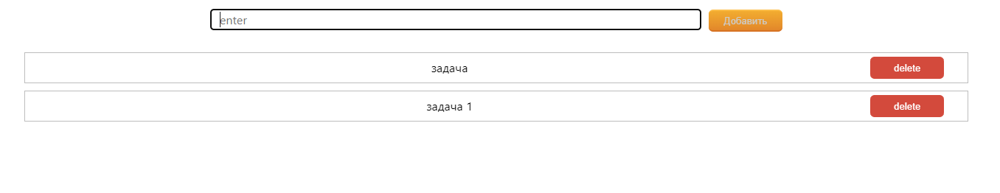

### Список задач

## Используемые технологии: React/firebase

#### v. 1.1.7

# В разработке

## Реализовано:

1. Запись задачи в базу данных
2. Написание, удаление задачи
3. пометка выполненной задачи

   

[GitHub](https://github.com/den10004/Todo.git).
[Vercel](https://todo-psi-seven.vercel.app/).
