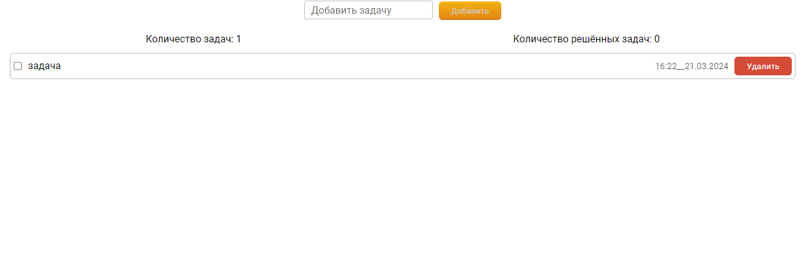

### Список задач

## Используемые технологии: React/firebase

[Деплой](https://todo-git-main-denis-sergeev-85.vercel.app/).

#### v. 1.2.4

## Реализовано:

1. Запись задачи в базу данных с датой создания задачи
2. Написание, удаление задачи
3. пометка выполненной задачи

